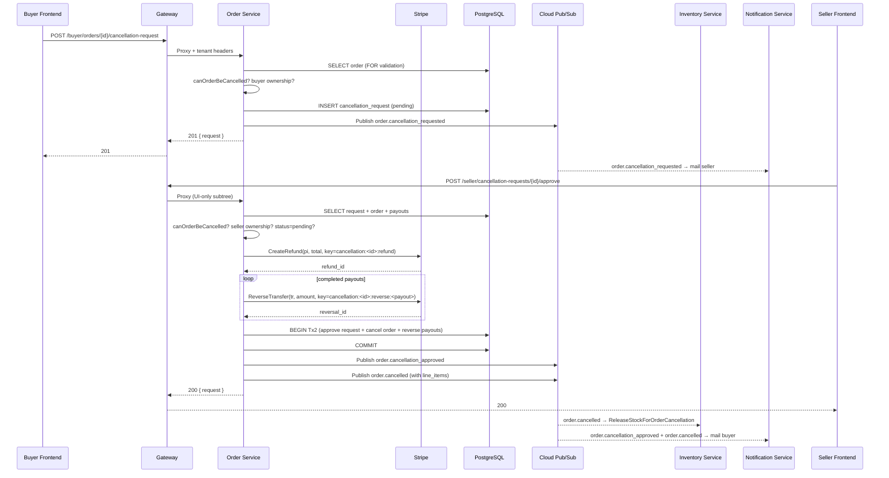
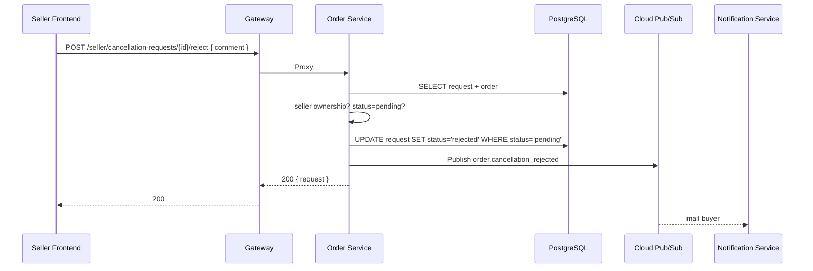
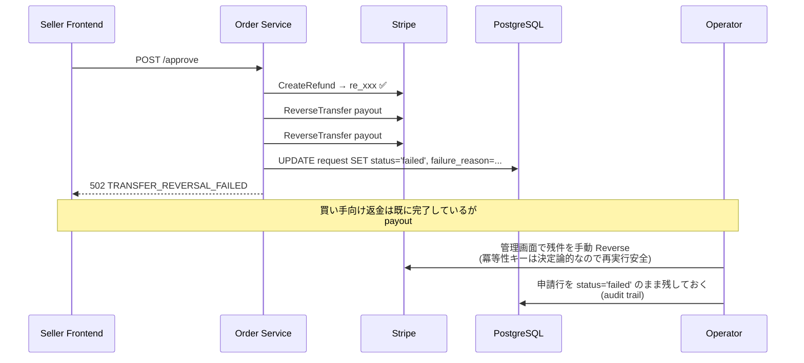

# 注文キャンセル申請設計書

本書は EC マーケットプレイスにおける **注文キャンセル申請** 機能の設計と実装を説明する。買い手が注文済みの商品についてキャンセルを申請し、セラーが承認または却下する。承認時には Stripe 返金・送金取消・在庫解放が順に実行される。

## 目次

- [概要](#概要)
- [ドメインモデル](#ドメインモデル)
- [シーケンス図](#シーケンス図)
- [API 仕様](#api-仕様)
- [状態遷移ルール](#状態遷移ルール)
- [Stripe 連携](#stripe-連携)
- [Pub/Sub イベント](#pubsub-イベント)
- [冪等性設計](#冪等性設計)
- [既知の制約 / 将来課題](#既知の制約--将来課題)
- [関連ドキュメント](#関連ドキュメント)

---

## 概要

### なぜ「申請 → 承認」ワークフローか

最も単純な実装は「買い手がクリックしたら即キャンセル」だが、マルチセラーマーケットにおいては以下の理由で採用していない:

1. **在庫出庫と出荷作業との race**: セラーが既に出荷準備に入っている注文を買い手が一方的に取り消せると、出荷後の返金・返品トラブルに直結する
2. **セラー判断の介在**: 「発送直前だが特別対応で取消を受ける」「次の便から出せるので却下する」といった判断をセラー側で行えるようにしたい
3. **返金処理の遅延許容**: Stripe 返金は即時確定する操作なので、誤操作での取消は事業者側リスクが大きい

このため本機能は **買い手が申請 → セラーが承認/却下** の 2 段階ワークフローとする。

### 対象範囲

- **申請可能な注文ステータス**: `pending` / `paid` / `processing`
- **申請不可**: `shipped` / `delivered` / `completed` / `cancelled` (出荷後は返品フローで対応する想定、本スコープ外)
- **スコープに含む**:
  - Stripe Refund (部分返金) による買い手への返金
  - Stripe Transfer Reversal による完了済み送金の巻き戻し
  - 在庫の再解放 (Pub/Sub 経由で inventory サービスに疎結合)
  - 関係者への通知メール (notification サービス)
- **スコープ外**:
  - 自動タイムアウト (一定時間セラーが対応しない場合の自動承認/却下)
  - 部分返金 (1 注文中の特定ラインのみ取消)
  - Stripe ディスピュート / チャージバック対応
  - `charge.refunded` webhook を経由した外部発生リファンドの自動反映

---

## ドメインモデル

### テーブル `order_svc.order_cancellation_requests`

[`infra/db/migrations/000016_create_order_cancellation_requests.up.sql`](../infra/db/migrations/000016_create_order_cancellation_requests.up.sql)

| カラム                      | 型                    | 用途                                           |
| --------------------------- | --------------------- | ---------------------------------------------- |
| `id`                        | UUID PK               | 申請 ID                                        |
| `tenant_id`                 | UUID NOT NULL         | RLS + マルチテナント境界                       |
| `order_id`                  | UUID NOT NULL         | 対象注文 (FK)                                  |
| `requested_by_auth0_id`     | VARCHAR(255) NOT NULL | 申請した買い手の Auth0 sub                     |
| `reason`                    | TEXT NOT NULL         | 買い手が入力した申請理由                       |
| `status`                    | VARCHAR(20) NOT NULL  | `pending` / `approved` / `rejected` / `failed` |
| `seller_comment`            | TEXT NULL             | セラーが記入するコメント (却下時は必須)        |
| `processed_by_seller_id`    | UUID NULL             | 処理したセラー ID                              |
| `processed_at`              | TIMESTAMPTZ NULL      | 処理日時                                       |
| `stripe_refund_id`          | VARCHAR(255) NULL     | 承認成功時の Stripe Refund ID                  |
| `failure_reason`            | TEXT NULL             | `failed` 時のエラー詳細                        |
| `created_at` / `updated_at` | TIMESTAMPTZ NOT NULL  |                                                |

### インデックス / 制約

- `ux_cancellation_pending_per_order`: `WHERE status = 'pending'` の部分ユニーク索引。**同一注文に同時 2 件の申請を作成できない** ことを DB で強制する
- `CHECK (status IN ('pending','approved','rejected','failed'))`
- `ENABLE ROW LEVEL SECURITY` + `FORCE ROW LEVEL SECURITY` + `tenant_isolation` ポリシー (000015 の規則を踏襲)

### `orders` テーブルへの追加カラム

| カラム                | 型               | 用途                         |
| --------------------- | ---------------- | ---------------------------- |
| `cancelled_at`        | TIMESTAMPTZ NULL | 承認時にタイムスタンプを保存 |
| `cancellation_reason` | TEXT NULL        | 申請理由を注文行にコピー     |

### `payouts` テーブルへの追加カラム

| カラム               | 型                | 用途                       |
| -------------------- | ----------------- | -------------------------- |
| `reversed_at`        | TIMESTAMPTZ NULL  | Transfer Reversal 実行時刻 |
| `stripe_reversal_id` | VARCHAR(255) NULL | Stripe が返す reversal id  |

また `domain.PayoutStatus*` 定数に `PayoutStatusReversed = "reversed"` を追加している。

### 状態遷移

```
pending ──approve── [Stripe OK + DB OK]─> approved (terminal)
   │        │
   │        └──[Stripe NG or write race]─> failed (terminal)
   │
   └──reject─> rejected (terminal)
```

- `approved` / `rejected` / `failed` は終端。`failed` でも部分ユニーク索引から外れるため、オペレータによる Stripe 手動リコンサイル後に買い手が再度申請することは可能
- 終端遷移は全て `WHERE status = 'pending'` ガード付き UPDATE で実行されるので、並列に承認/却下が起きても片方しか成立しない

---

## シーケンス図

### 正常系: 承認フロー



### 却下フロー



**却下では Stripe に一切触れない**。注文ステータスも変更しない。

### 部分失敗フロー (Stripe Transfer Reversal が失敗)



**設計上の意図**: 部分失敗時にも「返金だけは必ず完了している」状態にする。同じ冪等性キーで再実行しても Stripe 側でデデュープされるので、オペレータによるリカバリは再実行可能な操作となる。

---

## API 仕様

全エンドポイントは gateway の `/api/v1` プレフィックス配下にある。gateway は tenant context を解決した上で order サービスに HTTP プロキシする。

> **gRPC**: `order.proto` にキャンセル RPC 5 つ (`RequestOrderCancellation` 等) を宣言しているが、gRPC server は全て `codes.Unimplemented` を返す。gRPC メッセージには認証済み caller identity を渡す仕組みがなく、gRPC auth interceptor も未導入のため、サーブすると Stripe 返金を含む mutation を認可なしで実行できてしまう。REST handler (JWT 検証 → tenant.Context) が唯一の auth boundary。詳細は `grpcserver/cancellation_server.go` の NOTE を参照。

### 買い手向け

#### `POST /api/v1/buyer/orders/{id}/cancellation-request`

注文に対する新規キャンセル申請を作成する。

- **Body**: `{ "reason": "string (required)" }`
- **200/201**: 作成された `CancellationRequest` を返す
- **404**: 注文が存在しない、または呼び出し元が注文の買い手ではない (情報漏洩対策で 404)
- **409 `ORDER_NOT_CANCELLABLE`**: 注文が `shipped` 以降
- **409 `CANCELLATION_REQUEST_ALREADY_EXISTS`**: pending 申請が既に存在

#### `GET /api/v1/buyer/orders/{id}/cancellation-request`

注文に対する最新の申請を取得する。

- **200**: `CancellationRequest`
- **404**: 注文なし / 申請なし / 呼び出し元が買い手ではない

### セラー向け

セラー向けエンドポイントは **UI-only subtree** に置かれており、API トークンではアクセスできない。承認操作は Stripe 返金を即時トリガーする load-bearing な操作なので、v1 では意図的にトークン経路を塞いでいる。

#### `GET /api/v1/seller/cancellation-requests?status=&limit=&offset=`

ページネーション付きリスト。

- **200**: `{ items: [...], total, limit, offset }`

#### `GET /api/v1/seller/cancellation-requests/{id}`

単一申請の取得。

#### `POST /api/v1/seller/cancellation-requests/{id}/approve`

承認。Stripe 返金 + 送金取消 + DB 書き込み + イベント発行まで実行する。

- **Body**: `{ "seller_comment": "string (optional)" }`
- **200**: 承認後の `CancellationRequest`
- **404 `CANCELLATION_REQUEST_NOT_FOUND`** / **404 `NOT_ORDER_SELLER`**
- **409 `CANCELLATION_REQUEST_ALREADY_PROCESSED`**
- **409 `ORDER_NOT_CANCELLABLE`**: 承認時の再チェックで、買い手申請後にセラーが出荷した場合
- **502 `REFUND_FAILED`**: Stripe Refund が失敗 (DB は一切変更されない)
- **502 `TRANSFER_REVERSAL_FAILED`**: Refund は成功したが Reversal が失敗 — 申請は `failed` に遷移、Stripe 側オペレータリカバリが必要

#### `POST /api/v1/seller/cancellation-requests/{id}/reject`

却下。

- **Body**: `{ "seller_comment": "string (required)" }`
- **200**: 却下後の `CancellationRequest`
- **409 `CANCELLATION_REQUEST_ALREADY_PROCESSED`**

### Semantic error codes 一覧

全コードは `backend/services/order/internal/cancellation/errors.go` に定義。フロントエンドは `ApiError.code` で switch し、メッセージ翻訳を選択する。コードは公開 API 契約の一部であり、リネームは breaking change。

| Code                                     | HTTP | 意味                                                 |
| ---------------------------------------- | ---- | ---------------------------------------------------- |
| `ORDER_NOT_CANCELLABLE`                  | 409  | 注文ステータスがキャンセル可能な範囲外               |
| `CANCELLATION_REQUEST_NOT_FOUND`         | 404  | 申請 ID が存在しない / テナント違い                  |
| `CANCELLATION_REQUEST_ALREADY_EXISTS`    | 409  | pending 申請が既に存在                               |
| `CANCELLATION_REQUEST_ALREADY_PROCESSED` | 409  | 既に承認 / 却下 / 失敗済み                           |
| `REFUND_FAILED`                          | 502  | Stripe CreateRefund が失敗                           |
| `TRANSFER_REVERSAL_FAILED`               | 502  | Stripe ReverseTransfer が失敗 (Refund は既に完了)    |
| `NOT_ORDER_BUYER`                        | 404  | 呼び出し元が買い手ではない (情報漏洩対策で 404 wrap) |
| `NOT_ORDER_SELLER`                       | 404  | 呼び出し元がセラーではない                           |

---

## 状態遷移ルール

### 注文ステータスの許可マトリクス

| 注文ステータス | 申請可 | 承認時再チェック通過 |
| -------------- | :----: | :------------------: |
| `pending`      |   ✅   |          ✅          |
| `paid`         |   ✅   |          ✅          |
| `processing`   |   ✅   |          ✅          |
| `shipped`      |   ❌   |          ❌          |
| `delivered`    |   ❌   |          ❌          |
| `completed`    |   ❌   |          ❌          |
| `cancelled`    |   ❌   |          ❌          |

`canOrderBeCancelled(status string) bool` ([service.go](../backend/services/order/internal/cancellation/service.go)) が単一ソース。呼ばれる箇所:

1. **申請作成時** (`RequestCancellation`)
2. **承認のフェーズ 1 読み取り時** (`ApproveCancellation`) — 申請作成後にセラーが出荷した場合の race をここで検知
3. **承認のフェーズ 3 書き込み時** (SQL 内の `WHERE status = ANY($5)`) — フェーズ 1 とフェーズ 3 の間でも race があり得るため、最終的な権威は DB 制約

3 番目の DB ガードが外れた場合 (`ErrOrderStatusChanged`) は Stripe 操作が既に終わっているため、申請を `failed` にした上で `ORDER_NOT_CANCELLABLE` を返す。Stripe 側は手動リコンサイルが必要。

### 申請ステータスの WHERE ガード

全ての終端遷移は `WHERE status = 'pending'` を含む UPDATE で実装されている:

- `Reject` → UPDATE ... `WHERE status = 'pending'`
- `MarkFailed` → UPDATE ... `WHERE status = 'pending'`
- `ApproveTx` → UPDATE ... `WHERE status = 'pending'`

`RowsAffected == 0` の場合は `ErrAlreadyProcessed` を返し、サービス層で `CANCELLATION_REQUEST_ALREADY_PROCESSED` にマッピングする。

---

## Stripe 連携

### 使う API

| 操作     | Stripe API                          | 対象                                    |
| -------- | ----------------------------------- | --------------------------------------- |
| 返金     | `POST /v1/refunds`                  | `payment_intent` (プラットフォーム課金) |
| 送金取消 | `POST /v1/transfers/{id}/reversals` | 各セラーへの Transfer                   |

### なぜ常に部分返金か

マルチセラー checkout では 1 つの PaymentIntent が複数の注文を跨ぐ (参照: [payment.md](./payment.md))。キャンセルは 1 注文単位なので、常に `order.TotalAmount` 分のみの **部分返金** になる。Stripe の Refund API は `amount` を指定すれば部分返金として扱われる。

### 送金取消の対象

`payouts.status = 'completed'` かつ `stripe_transfer_id IS NOT NULL` の payout のみ reversal を試みる。以下は意図的にスキップ:

- `pending` 状態の payout: webhook がまだ Transfer を作成していない。`total_amount` 全額は既に Refund で返金済みなので、Transfer が後から作成されないように webhook 側でもスキップされる必要がある (将来の強化点)
- `stripe_transfer_id IS NULL` の payout: Transfer 作成失敗または未実施。同上

### 冪等性キー

```
refund:   "cancellation:<request_id>:refund"
reverse:  "cancellation:<request_id>:reverse:<payout_id>"
```

- **決定論的**: (request_id, action, [payout_id]) の組で一意
- **安全な再実行**: 同じキーで 2 回目の呼び出しは Stripe 側で完全に同じレスポンスを返す。サービス側の部分失敗リカバリ (手動オペレーション含む) を安全に再試行できる

`Client.CreateRefund` / `Client.ReverseTransfer` のユニットテスト ([client_test.go](../backend/services/order/internal/stripe/client_test.go)) は httptest スタブでこの Idempotency-Key ヘッダの送信を検証している。

---

## Pub/Sub イベント

トピック: `order-events` (既存)

### イベント型

| Type                           | Subscriber                  | 用途                                          |
| ------------------------------ | --------------------------- | --------------------------------------------- |
| `order.cancellation_requested` | notification                | セラーに「申請が来ました」メール              |
| `order.cancellation_rejected`  | notification                | 買い手に「却下されました」メール              |
| `order.cancellation_approved`  | notification                | 買い手に「承認されました」メール (返金額付き) |
| `order.cancelled`              | notification, **inventory** | 買い手に最終メール、inventory が在庫解放      |

### `order.cancelled` のペイロード

`order.cancelled` は単独で「注文がキャンセルされた」を表す汎用イベントで、今後 returns / admin cancel からも発行される可能性がある。ここでは cancellation が先行して発行する。

```json
{
  "order_id": "uuid",
  "tenant_id": "uuid",
  "seller_id": "uuid",
  "buyer_auth0_id": "auth0|...",
  "request_id": "uuid",
  "reason": "changed my mind",
  "cancelled_at": "2026-04-12T12:34:56Z",
  "line_items": [{ "sku_id": "uuid", "product_name": "...", "sku_code": "...", "quantity": 2 }]
}
```

`line_items` を同梱するのは意図的な設計選択: inventory サービスが注文サービスに RPC で問い合わせせずにそのまま在庫解放できるようにしている。注文の line_items は immutable なのでスナップショットで十分。

### Subscription 配線

| Subscription                | Consumer     | 出典                                                                  |
| --------------------------- | ------------ | --------------------------------------------------------------------- |
| `order-events-notification` | notification | 既存。cancellation 4 イベントをハンドリングするために switch 文へ追加 |
| `order-events-inventory`    | inventory    | **本 PR で新規追加**。`ReleaseStockForOrderCancellation` を呼ぶ       |

Pub/Sub subscription 自体のプロビジョニングは `infra/` 側に TODO として残っている。ローカル/本番デプロイ時に `gcloud pubsub subscriptions create order-events-inventory --topic=order-events` を実行するか、Terraform に追加すること。

---

## 冪等性設計

キャンセル承認は外部副作用を 3 回伴う (Stripe Refund / Stripe Reversal / 在庫解放) ため、全レイヤで冪等化する。

### Stripe 層

前述の決定論的 Idempotency-Key で、API 呼び出しレベルで Stripe が自動的にデデュープする。

### DB 層

- `cancellation_requests` への承認 UPDATE は `WHERE status = 'pending'`
- `orders` への `cancelled` UPDATE は `WHERE status IN ('pending','paid','processing')`
- `payouts` の reversed フラグは承認トランザクション内でのみ立つ

同じ承認 RPC を 2 回受けた場合、2 回目は `ErrAlreadyProcessed` で 409 を返し、Stripe API は叩かない。

### Pub/Sub / inventory 層

`order.cancelled` はトピックから複数配信される可能性がある (at-least-once)。inventory 側は `stock_movements` テーブルに `reference_type = 'order_cancellation'`, `reference_id = order_id` で記録し、同じ (tenant, reference) が既にあれば **repository が no-op で返す**:

```sql
-- 擬似コード (実装: inventory/internal/repository/inventory_repository.go)
SELECT 1 FROM stock_movements
WHERE tenant_id = $1 AND reference_type = 'order_cancellation' AND reference_id = $2
LIMIT 1
```

一致があれば `ReleaseStockForOrderCancellation` は `(already=true, err=nil)` を返し、subscriber は ack する。サブスクライバ側のユニットテスト ([order_subscriber_test.go](../backend/services/inventory/internal/subscriber/order_subscriber_test.go)) で同一イベントの 2 回配信を検証している。

### 承認処理の 2 段階トランザクション

DB トランザクションを Stripe 呼び出しを跨いで保持しないために、承認処理は明示的に 2 段階に分けている:

1. **Tx1 (読み取り)**: 申請行 + 注文行 + payouts の SELECT、所有権 + ステータス検証。COMMIT せずに Stripe 呼び出しへ進む前に **トランザクションはクローズ済み**
2. **Stripe 呼び出し (接続なし)**: Refund → 各 payout の Reversal を順次実行
3. **Tx2 (書き込み)**: 申請 / 注文 / payouts を 1 本のトランザクションで UPDATE、WHERE ガード付き

これにより DB コネクションプールが Stripe のレイテンシで長時間占有されない。代わりに、Tx1 と Tx2 の間で状態が変化する race window が存在するため、Tx2 で WHERE ガードが外れた場合の `ErrOrderStatusChanged` 復旧パスを設計に組み込んでいる。

---

## 既知の制約 / 将来課題

### 1. セラー操作用 API トークン非対応

セラー向け承認 / 却下エンドポイントは UI-only subtree に配置している。Stripe 返金を即時トリガーする load-bearing 操作なので、v1 ではトークンの権限モデルが整備されるまで UI 経由に限定する。

**将来**: 専用の `orders:cancel` scope を導入してトークンでも承認できるようにする。

### 2. gRPC キャンセル RPC は Unimplemented

`order.proto` にキャンセル RPC 5 つを宣言しているが、gRPC server は全て `codes.Unimplemented` を返す。gRPC メッセージに認証済み caller identity を渡す仕組みがなく、gRPC auth interceptor も未導入のため、サーブすると Stripe 返金を含む mutation を認可なしで実行できてしまう。

**将来**: proto メッセージに authenticated actor フィールドを追加するか、gRPC auth interceptor で JWT → context 解決を実装した上で有効化する。

### 3. 部分失敗の自動リトライワーカー未実装

Refund 成功 + Reversal 途中失敗 → 申請は `failed` に落ちるが、オペレータが Stripe 管理画面で手動リコンサイルする必要がある。Idempotency-Key が決定論的なので手動再実行は安全だが、自動化はされていない。

**将来**: `failed` 申請を拾って冪等性キーで再試行するバックグラウンドワーカーを追加する。

### 4. `charge.refunded` webhook 非対応

Stripe 管理画面からオペレータが手動で返金した場合、その返金は本システムに反映されない。webhook 経路で受信して `cancellation_requests` 行を自動生成する実装は未対応。

**将来**: `charge.refunded` / `charge.dispute.created` 受信時に対応する cancellation_request レコードを生成する webhook handler を追加する。

### 5. 自動タイムアウトなし

セラーがいつまでも pending 申請を放置した場合の自動承認/却下は実装していない。運用ルールで「24 時間以内に対応」などを決めて通知頻度で催促する想定。

**将来**: `pending` 申請の経過時間を監視するクーロン + 自動承認オプションを追加できる設計余地はある。

### 6. 部分キャンセル / 返品非対応

「1 注文中の特定ラインだけキャンセル」は非対応。全ライン一括キャンセルのみ。部分キャンセルが必要になった場合はモデル拡張 (lines ごとの cancellation_lines テーブル) が必要。

### 7. Payout が pending 状態のまま残った場合の扱い

承認時に payout が `pending` (webhook が Transfer を作成する前) の場合、reversal はスキップされる。その後 webhook が Transfer を作成してしまうと送金されたまま戻らないリスクがある。

**対策 (v1)**: order が `cancelled` になった以降に Transfer を作成しないよう webhook ハンドラ側でもガードする。

**将来**: Transfer 作成済み payout を検出した時点で自動 reverse する補填ジョブを追加。

---

## 関連ドキュメント

- [決済設計書](./payment.md) — Separate Charges and Transfers モデルと Transfer / Refund の関係
- [カート・チェックアウト設計書](./cart-and-checkout.md) — 複数セラー checkout の詳細
- [アーキテクチャ設計書](./architecture.md) — 全体像、RLS、イベント駆動アーキテクチャ
- [Stripe Refunds 公式ドキュメント](https://stripe.com/docs/refunds)
- [Stripe Transfer Reversal 公式ドキュメント](https://stripe.com/docs/connect/charges-transfers#reversing-transfers)
