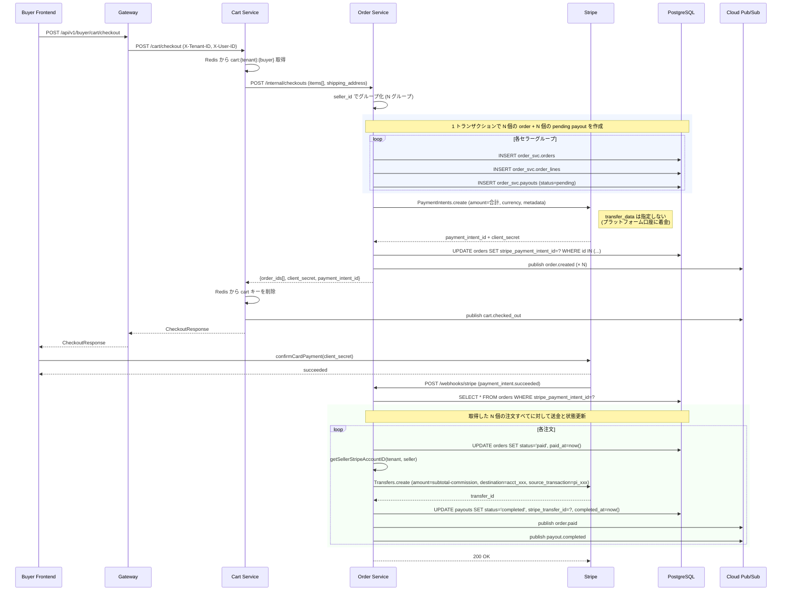

# 決済設計書

本書は EC マーケットプレイスにおける決済フローの設計と実装を説明する。マルチセラー構成の注文を 1 回の決済で処理するため、**Stripe Connect の Separate Charges and Transfers** モデルを採用している。

## 目次

- [概要](#概要)
- [Stripe Connect のセットアップ](#stripe-connect-のセットアップ)
- [決済フロー](#決済フロー)
- [コミッション計算](#コミッション計算)
- [Payout ライフサイクル](#payout-ライフサイクル)
- [Webhook 処理](#webhook-処理)
- [エラーハンドリングとべき等性](#エラーハンドリングとべき等性)
- [テストモード](#テストモード)
- [既知の制約](#既知の制約)

---

## 概要

### なぜ Separate Charges and Transfers か

Stripe Connect には主に 2 つのマーケットプレイス決済モデルがある:

| モデル | 特徴 | マルチセラー対応 |
| --- | --- | --- |
| **Destination Charges** | `PaymentIntent.transfer_data.destination` に出店者の Connected Account を指定。決済が直接出店者の残高に入り、プラットフォームは application fee のみ受け取る。 | **不可** — 1 PaymentIntent に対して送金先は 1 つのみ |
| **Separate Charges and Transfers** | プラットフォーム口座で決済を受け、別途 `Transfer` API を使って各 Connected Account に個別送金する。 | **可** — 1 PaymentIntent + N Transfers |

本マーケットプレイスでは買い手が 1 回のカート操作で複数セラーの商品を同時購入する Amazon 型 UX を目指すため、**Separate Charges and Transfers** を採用する。決済は 1 回の `payment_intent.confirm` で完了させ、内部的には N 個の注文に分割されて個別に送金される。

### 基本設計原則

- **1 checkout = 1 PaymentIntent = N orders (1 per seller) = N transfers**
- 注文間のグルーピングは `orders.stripe_payment_intent_id` カラムで表現し、新しいテーブルは追加しない
- 送金は **決済成功後の webhook で非同期に実行** する (注文作成時には送金を発行しない)
- Payout レコードは注文作成と同時に `pending` 状態で作成し、送金完了時に `completed` に遷移させる

---

## Stripe Connect のセットアップ

### Connected Account の種類

本システムでは **Standard アカウント** を前提とする。セラーは独自の Stripe ダッシュボードを持ち、Terms of Service への同意と KYC を Stripe 側で完結させる。プラットフォームは Connected Account ID (`acct_...`) のみを保持する。

### セラー登録時のフロー

```
1. セラーがサインアップ (auth service 経由)
2. auth service が Stripe Connect Standard のオンボーディングリンクを生成
   → /accounts + /account_links API
3. セラーが Stripe のオンボーディング画面で本人確認・口座連携を完了
4. Stripe から webhook (account.updated) → auth service
5. auth service が sellers.stripe_account_id を保存
```

**本書執筆時点の実装状況**:
- `sellers.stripe_account_id` カラムは既に存在する (`infra/db/migrations/000002_create_tenants.up.sql` / `auth_svc.sellers`)
- オンボーディングフロー自体は未実装
- `order service` 側は `acct_stub_<seller_id>` を返す関数 (`getSellerStripeAccountID`) をプレースホルダとして使用している

この placeholder は [既知の制約](#既知の制約) に記載し、本番移行前に解消する必要がある。

---

## 決済フロー

### 正常系シーケンス



### 金額の内訳

```
buyer 支払額 (PaymentIntent amount)
  = Σ (各セラーの subtotal + 送料)

セラー受取額 (各 Transfer amount)
  = 各セラーの subtotal - 各セラーの commission_amount
  (送料の扱いは shipping-fee-handling 設計による: 現状はプラットフォーム収益)

プラットフォーム収益
  = Σ commission_amount + (送料 - 配送コスト)
```

送料を買い手が支払ってもセラーに送金しない場合、差分は自動的にプラットフォーム口座に残る (Stripe 側で計算を意識する必要はない)。

### なぜトランザクションを 2 段階に分けるか

注文行の INSERT と PaymentIntent 発行は次の順で実行される:

1. **DB トランザクション #1** — N 個の order + order_line + pending payout を 1 トランザクションで書き込む
2. **Stripe 呼び出し** — PaymentIntent を作成
3. **DB トランザクション #2** — 発行された `stripe_payment_intent_id` を全 order に書き戻す

Stripe 呼び出しの外で DB トランザクションを保持し続けると、ロックが長引き他の注文に影響する。また、Stripe のエラーで DB トランザクションをロールバックしてしまうとクライアント側の状態と不整合になるため、**先に DB に書いてから Stripe に投げる** 順序としている。Stripe 呼び出しが失敗した場合は既に作成した注文を `status='cancelled'` にマークする補償ロジックで対応する (詳細は [エラーハンドリング](#エラーハンドリングとべき等性))。

---

## コミッション計算

### ルールの優先順位

`order_svc.commission_rules` テーブルに保存されたルールを `seller_id` / `category_id` / `priority` / 有効期間で絞り込み、最も優先度の高い 1 件を適用する。

```
1. seller_id 一致 かつ category_id 一致   (specific seller + specific category)
2. seller_id 一致 かつ category_id NULL   (specific seller + all categories)
3. seller_id NULL  かつ category_id 一致  (all sellers + specific category)
4. seller_id NULL  かつ category_id NULL  (default rate)
```

実装は `backend/services/order/internal/repository/commission_repo.go` の `GetApplicableRule` にある。同じ優先度のルールが複数存在する場合は `priority` カラム (大きいほど優先) で決定する。

### 計算式

```
commission_amount = subtotal × rate_bps ÷ 10000
```

`rate_bps` は basis points (1 bps = 0.01%)。たとえば `rate_bps = 1000` は 10% を意味する。端数は整数除算で切り捨てる。

### マルチセラー checkout での呼び出しパターン

CreateCheckout 内で **セラーごとに 1 回** `GetApplicableRule(ctx, tenantID, sellerID, nil)` を呼ぶ。カテゴリ別コミッションは現状 MVP では未使用のため `category_id` は常に `nil`。

---

## Payout ライフサイクル

### 状態遷移

```
┌─────────┐  CreateCheckout  ┌─────────┐  payment_intent.succeeded + Transfer 成功  ┌───────────┐
│         │ ──────────────▶ │         │ ─────────────────────────────────────────▶ │           │
│  (new)  │                  │ pending │                                             │ completed │
│         │                  │         │ ──────── Transfer 失敗 ──────▶  ┌────────┐ │           │
└─────────┘                  └─────────┘                                 │ failed │ └───────────┘
                                                                         └────────┘
```

### フィールドの意味

| フィールド | pending | completed | failed |
| --- | --- | --- | --- |
| `amount` | subtotal − commission (確定) | 同じ | 同じ |
| `stripe_transfer_id` | NULL | `tr_...` | NULL |
| `completed_at` | NULL | now() | NULL |
| `status` | `pending` | `completed` | `failed` |

`failed` 状態のレコードは運用者が手動で再実行するか、別の送金手段で対応する (詳細は [エラーハンドリング](#エラーハンドリングとべき等性))。

---

## Webhook 処理

### 受信エンドポイント

```
POST /webhooks/stripe
```

ハンドラ: `backend/services/order/internal/handler/webhook_handler.go`

- JWT 検証なし (Stripe-Signature ヘッダで検証)
- `webhook.ConstructEvent(payload, sigHeader, webhookSecret)` で署名検証
- `webhookSecret` は環境変数 `STRIPE_WEBHOOK_SECRET`

### 対応イベントタイプ

| Event Type | 処理 |
| --- | --- |
| `payment_intent.succeeded` | `HandlePaymentSuccess(piID)` — 対応する全 order を `paid` に更新し、各セラーに Transfer を発行、payouts を `completed` に更新 |
| `payment_intent.payment_failed` | (TODO) 対応する全 order を `cancelled` に更新し、payouts を `failed` に更新 |
| `charge.refunded` | (TODO) 返金対応 — 別途設計 |
| `transfer.failed` | (TODO) payouts を `failed` に更新、運用者にアラート |

現状は `payment_intent.succeeded` のみ実装済み。それ以外のイベントは `slog.Debug` で記録のみ。

### マルチ order 検索

Webhook は 1 つの PaymentIntent に対応する **複数の注文** を処理する必要がある。`order_repo.FindAllByStripePaymentIntentID(ctx, piID)` が RLS を無視してクロステナント検索を行う (webhook は `X-Tenant-ID` を持たないため)。

> **重要**: クロステナント検索は webhook など明確に信頼できるパスからのみ呼び出す。通常のアプリケーションパスからは `FindByID(ctx, tenantID, orderID)` 系を使うこと。

---

## エラーハンドリングとべき等性

### 1. CreateCheckout 中の失敗

| 失敗箇所 | 対応 |
| --- | --- |
| DB トランザクション #1 | `TenantTx` のロールバックで注文と payout をすべて巻き戻す。buyer にエラーレスポンスを返す。 |
| PaymentIntent 作成失敗 | 作成済みの注文を `status='cancelled'` にマークする補償処理を実行。buyer にエラーレスポンスを返す。cart は削除しない。 |
| DB トランザクション #2 (PI ID 書き戻し) | 注文は作成されるが `stripe_payment_intent_id` が NULL のまま。buyer にエラーレスポンスを返す。運用者が PaymentIntent を手動でキャンセルするか、再試行バッチで補正する。 |

補償処理の詳細は `OrderService.CreateCheckout` の実装コメントに記載する。

### 2. Webhook のべき等性

Stripe は同じ webhook を複数回送る可能性がある (配信再試行)。べき等性を保つため:

- `HandlePaymentSuccess` は注文の現在 `status` をチェックし、既に `paid` 以降ならスキップする
- `payouts.status` が既に `completed` なら Transfer を発行しない
- Transfer 発行時に `Transfer.IdempotencyKey = "payout-" + payoutID.String()` を指定し、Stripe 側でも重複を防止する

### 3. Transfer 失敗時の扱い

Transfer API が失敗した場合:

1. 該当 payout を `failed` に更新
2. `slog.Error` でエラーを記録
3. `payout.failed` イベントを発行 (notification service が運用者にアラート)
4. 注文自体は `paid` のまま (決済は成功している)

運用者は運用ダッシュボードから手動で再試行するか、Stripe ダッシュボードから直接送金する。

### 4. 同一 PI ID の Webhook が到着したが対応する注文が見つからない

- CreateCheckout の DB トランザクション #2 が未完了の状態でブラウザ側が決済確認してしまった場合に発生し得る
- ハンドラは 404 を返す (Stripe は後続で再試行する)
- 再試行までに DB トランザクション #2 が完了していれば正常処理される

---

## テストモード

### ローカル開発

`.env` で Stripe テストキーを設定する:

```bash
STRIPE_SECRET_KEY=sk_test_...
STRIPE_WEBHOOK_SECRET=whsec_... # stripe listen で取得
```

### ローカル webhook 受信

Stripe CLI を使って webhook をローカルに転送:

```bash
stripe listen --forward-to localhost:8084/webhooks/stripe
```

`stripe listen` が出力する `whsec_...` を `STRIPE_WEBHOOK_SECRET` に設定すること。

### テスト決済のトリガ

```bash
# 成功パターン
stripe trigger payment_intent.succeeded

# 失敗パターン (未実装、TODO)
stripe trigger payment_intent.payment_failed
```

テストカード番号は [Stripe 公式ドキュメント](https://stripe.com/docs/testing) を参照。

---

## 既知の制約

MVP 段階で残っている制約事項:

### 1. Connected Account ID ルックアップがプレースホルダ

**場所**: `backend/services/order/internal/service/order_service.go` の `getSellerStripeAccountID` ヘルパー

**現状**: `"acct_stub_" + sellerID.String()` を返すスタブ実装

**あるべき姿**: auth service に `GetSellerStripeAccountID(ctx, tenantID, sellerID)` RPC を追加し、`auth_svc.sellers.stripe_account_id` カラムから取得する。null の場合は「Stripe 未連携」エラーを返し、checkout 自体をブロックする。

**影響**: 本番環境では Transfer API が `acct_stub_xxx` を宛先にした時点で失敗する。本番リリース前に必ず解消すること。

### 2. Connected Account オンボーディングフローが未実装

セラー登録時に Stripe オンボーディングリンクを生成するフローがまだ無い。`sellers.stripe_account_id` は手動 INSERT する必要がある。

**あるべき姿**: auth service の `POST /sellers` 完了時に Stripe `account_links.create` を呼び、オンボーディング URL をレスポンスに含める。

### 3. 返金・キャンセルフローが未設計

`charge.refunded` や注文キャンセル時の Transfer 巻き戻し (`Transfer.create` の逆、`Transfer Reversal`) が未設計。

### 4. 送料の扱いが単純化されている

現状は全送料をプラットフォームが受け取る設計。実際にはセラーが送料を負担するケースやマーケット全体で送料無料キャンペーンを打つケースなど、送料の分配ロジックは別途設計する必要がある。

### 5. 複数通貨対応

現状は `JPY` 固定前提。異なる通貨の商品が同じカートに入った場合は CreateCheckout でエラーを返す想定だが、実装上のバリデーションは未確認。

---

## 関連ドキュメント

- [カート・チェックアウト設計書](./cart-and-checkout.md) — カート側の詳細
- [アーキテクチャ設計書](./architecture.md) — 全体像、データモデル、RLS
- [Stripe Connect 公式ドキュメント](https://stripe.com/docs/connect) — Separate Charges and Transfers の詳細
