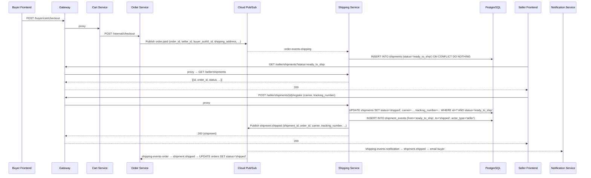
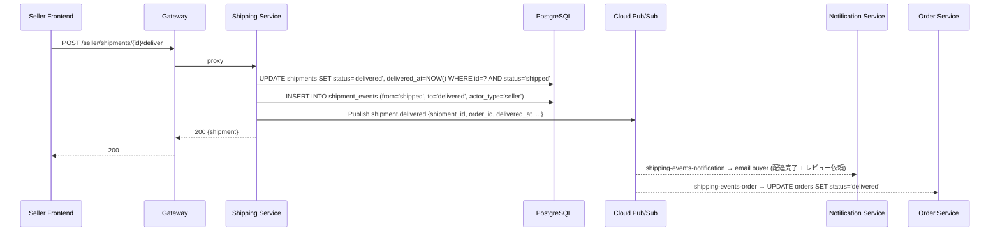
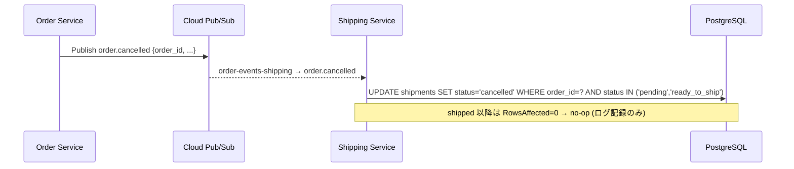

# 配送サービス設計書

本書は EC マーケットプレイスにおける **配送 (shipping)** 機能の設計と実装を説明する。買い手が商品を購入すると出荷 (shipment) が自動作成され、セラーが追跡番号を登録して発送完了とする。配送状況は買い手リアルタイムで確認でき、ステータス変化時には通知メールが送信される。

## 目次

- [背景と課題](#背景と課題)
- [v1 スコープ](#v1-スコープ)
- [ユースケース](#ユースケース)
- [ドメインモデル](#ドメインモデル)
- [状態遷移](#状態遷移)
- [シーケンス図](#シーケンス図)
- [API 仕様](#api-仕様)
- [Pub/Sub イベント設計](#pubsub-イベント設計)
- [既存サービスへの影響](#既存サービスへの影響)
- [冪等性設計](#冪等性設計)
- [既知の制約 / 将来課題](#既知の制約--将来課題)
- [関連ドキュメント](#関連ドキュメント)

---

## 背景と課題

導入前は「配送」に関する情報が order サービスに散在し、以下の課題があった。

| 課題 | 詳細 |
|------|------|
| **追跡情報が保存できない** | `orders` テーブルに `tracking_number`・`carrier`・`shipped_at`・`delivered_at` カラムが存在せず、買い手への追跡番号通知が不可能 |
| **出荷実体がない** | shipment という集約がないため、配送イベント履歴の記録・将来の分割出荷への対応が困難 |
| **ステータス遷移が曖昧** | `UpdateOrderStatus` で任意の文字列を受け付けており、shipped/delivered の遷移ガードが薄かった |
| **イベントペイロードが貧弱** | `order.shipped` は `{order_id}` のみで、通知メールに追跡番号を含めることができなかった |

これらを解消するために **shipping サービス** を独立した境界として切り出す。

---

## v1 スコープ

| 項目 | v1 方針 |
|------|---------|
| キャリア連携 | **手動入力のみ** — セラーがキャリア名・追跡番号を手動入力。自動追跡 API・送り状 PDF 発行は将来 |
| shipment 作成 | `order.paid` イベントを購読し、shipping サービスが自動で `ready_to_ship` の shipment を作成 |
| 住所帳 | **持たない** — `orders.shipping_address` の JSON スナップショットを shipment にコピーして利用 |
| 分割出荷 | **非対応** — 1 注文 = 1 shipment (v1) |
| 再配達 / 不在対応 | **スコープ外** |

---

## ユースケース

### UC-1: 注文確定後の出荷準備

```
買い手が決済完了
  → order サービスが order.paid を発行
  → shipping サービスが order.paid を購読
  → shipment(status=ready_to_ship) を自動作成
  → セラーダッシュボードに「発送待ち」として表示
```

買い手が CartCheckout を完了すると payment が確定し、`order.paid` が発行される。shipping サービスはそのイベントを受け取って、注文の `shipping_address` スナップショットをコピーした shipment 行を作成する。

**冪等性**: `shipments.order_id` に UNIQUE 制約があるため、同一 `order_id` のイベントが複数回届いても INSERT は 1 回だけ成功する (ON CONFLICT DO NOTHING)。

---

### UC-2: セラーによる発送登録

```
セラーが梱包・発送
  → セラーダッシュボードで carrier + tracking_number を入力
  → POST /seller/shipments/{id}/register
  → shipment が ready_to_ship → shipped に遷移
  → shipment.shipped イベントを shipping-events に発行
  → notification が買い手に追跡番号入りメールを送信
  → order サービスが orders.status を shipped に更新
```

`carrier` と `tracking_number` は必須。`shipped_at` は省略時に現在時刻を使用する。WHERE ガード付き UPDATE により、既に `shipped` の場合は 409 SHIPMENT_ALREADY_REGISTERED を返す。

---

### UC-3: 配達完了マーク

```
セラーが配達確認
  → POST /seller/shipments/{id}/deliver
  → shipment が shipped → delivered に遷移
  → shipment.delivered イベントを発行
  → notification が買い手に配達完了メール + レビュー依頼を送信
  → order サービスが orders.status を delivered に更新
```

v1 ではセラーが手動でマークする。将来はキャリア webhook によって自動遷移させる。

---

### UC-4: 買い手による配送状況確認

```
買い手が注文詳細を閲覧
  → GET /buyer/orders/{order_id}/shipment
  → status / carrier / tracking_number / shipped_at / delivered_at を返却
  → フロントエンドが追跡番号にキャリア URL テンプレートを付与して表示
```

認可: 呼び出し元の `buyer_auth0_id` が shipment に記録されているものと一致しない場合は 404 を返す (情報漏洩防止)。

---

### UC-5: 注文キャンセルと配送の整合

```
order.cancelled イベントを受信
  → 対応する shipment を cancelled に遷移
```

ただし shipment が既に `shipped` 以降の場合は no-op でログに記録する (返品フローは v1 外)。

order-cancellation 側では `shipped` 以降の注文はキャンセル申請不可 (`ORDER_NOT_CANCELLABLE`) と定義されており、正常フローでは発送済み注文の cancelled イベントは届かない。shipping サービスはこれを信頼しつつも、防衛的に WHERE ガードを設ける。

---

### UC-6: 発送前の注文取消との整合

注文キャンセル設計書 (`docs/order-cancellation.md`) が定める「`shipped` 以降はキャンセル申請不可」というルールと shipping は整合している。cancellation サービスはキャンセル申請時に `order.status` を検査しており、shipment ステータスを直接参照しない。将来キャリア API 連携でより早期に `shipped` 遷移が起きた場合は、cancellation 側の事前チェックで `ORDER_NOT_CANCELLABLE` を返す設計が継続して成立する。

---

## ドメインモデル

### テーブル `shipping_svc.shipments`

[`infra/db/migrations/000020_create_shipments.up.sql`](../infra/db/migrations/000020_create_shipments.up.sql)

| カラム | 型 | 用途 |
|---|---|---|
| `id` | UUID PK | shipment ID |
| `seller_id` | UUID NOT NULL | 出荷責任を持つセラー |
| `order_id` | UUID NOT NULL UNIQUE | 紐付く注文 (v1: 1:1) |
| `buyer_auth0_id` | VARCHAR(255) NOT NULL | 通知 / 認可チェックに使用 |
| `status` | VARCHAR(20) NOT NULL | `pending` / `ready_to_ship` / `shipped` / `delivered` / `cancelled` |
| `shipping_address` | JSONB NOT NULL | 注文時点の配送先スナップショット |
| `carrier` | VARCHAR(64) NULL | `yamato` / `sagawa` / `jp_post` / `other` 等 |
| `tracking_number` | VARCHAR(128) NULL | キャリアの追跡番号 |
| `shipped_at` | TIMESTAMPTZ NULL | 発送日時 |
| `delivered_at` | TIMESTAMPTZ NULL | 配達完了日時 |
| `note` | TEXT NULL | セラー任意メモ |
| `created_at` / `updated_at` | TIMESTAMPTZ NOT NULL | |

**制約**:
- `UNIQUE (order_id)` — 同一注文に対して shipment は 1 件のみ
- `CHECK (status IN ('pending','ready_to_ship','shipped','delivered','cancelled'))`

### テーブル `shipping_svc.shipment_events` (監査ログ)

| カラム | 型 | 用途 |
|---|---|---|
| `id` | UUID PK | |
| `shipment_id` | UUID NOT NULL FK → `shipments(id)` | |
| `from_status` | VARCHAR(20) NULL | 遷移前ステータス |
| `to_status` | VARCHAR(20) NOT NULL | 遷移後ステータス |
| `actor_type` | VARCHAR(20) NOT NULL | `seller` / `system` |
| `actor_id` | VARCHAR(255) NULL | seller_id or Auth0 sub |
| `payload` | JSONB NULL | 付加情報 (tracking 情報の差分など) |
| `created_at` | TIMESTAMPTZ NOT NULL | |

---

## 状態遷移

```
                ┌─────────────────────────────────┐
                │  order.paid を受信               │
                ▼                                  │
[pending] ──►  [ready_to_ship] ──register──► [shipped] ──deliver──► [delivered]
     │                │
     └──────────────  └──── order.cancelled を受信
                            (shipped 以降は no-op)
                                    ▼
                              [cancelled]
```

| 遷移 | トリガー | ガード |
|------|---------|--------|
| `pending → ready_to_ship` | `order.paid` イベント受信 (自動) | upsert (ON CONFLICT DO NOTHING) |
| `ready_to_ship → shipped` | `POST /seller/shipments/{id}/register` | WHERE status='ready_to_ship' |
| `shipped → delivered` | `POST /seller/shipments/{id}/deliver` | WHERE status='shipped' |
| `pending/ready_to_ship → cancelled` | `order.cancelled` イベント受信 (自動) | WHERE status IN ('pending','ready_to_ship') |

`RowsAffected == 0` の場合は遷移対象外として `ErrInvalidTransition` を返す。

---

## シーケンス図

### 正常系: 発送登録フロー



### 配達完了フロー



### 注文キャンセルとの整合フロー



---

## API 仕様

全エンドポイントは gateway の `/api/v1` プレフィックス配下。gateway が呼び出し元コンテキスト（seller_id / Auth0 sub）を解決した上で shipping サービスに HTTP プロキシする。

### セラー向け (UI-only subtree — `apitoken.Block` 済み)

発送登録・配達完了マークは注文の実体変更を伴う load-bearing 操作のため、v1 では UI 経由に限定する。

#### `GET /api/v1/seller/shipments?status=&limit=&offset=`

自セラーの shipment 一覧をページネーション付きで返す。

- **200**: `{ items: [...], total, limit, offset }`
- `status` パラメータ省略時は全ステータスを返す

#### `GET /api/v1/seller/shipments/{id}`

shipment 単一取得。

- **200**: `Shipment`
- **404 `SHIPMENT_NOT_FOUND`**: ID なし / テナント違い / セラー違い

#### `GET /api/v1/seller/orders/{order_id}/shipment`

注文 ID から shipment を逆引きする。

- **200**: `Shipment`
- **404 `SHIPMENT_NOT_FOUND`**

#### `POST /api/v1/seller/shipments/{id}/register`

発送登録。`ready_to_ship → shipped` に遷移し、追跡番号を記録する。

- **Body**: `{ "carrier": "string (required)", "tracking_number": "string (required)", "shipped_at": "RFC3339 (optional)", "note": "string (optional)" }`
- **200**: 遷移後の `Shipment`
- **400 `TRACKING_NUMBER_REQUIRED`**: tracking_number または carrier が空
- **404 `SHIPMENT_NOT_FOUND`** / **404 `NOT_ORDER_SELLER`**
- **409 `SHIPMENT_ALREADY_REGISTERED`**: 既に `shipped` 以降
- **409 `SHIPMENT_INVALID_TRANSITION`**: status が `ready_to_ship` 以外

#### `POST /api/v1/seller/shipments/{id}/deliver`

配達完了マーク。`shipped → delivered` に遷移する。

- **Body**: `{ "delivered_at": "RFC3339 (optional)" }`
- **200**: 遷移後の `Shipment`
- **404 `SHIPMENT_NOT_FOUND`** / **404 `NOT_ORDER_SELLER`**
- **409 `SHIPMENT_INVALID_TRANSITION`**: status が `shipped` 以外

### 買い手向け

#### `GET /api/v1/buyer/orders/{order_id}/shipment`

自分の注文の shipment を取得する。`carrier` + `tracking_number` + `status` + `shipped_at` を含む。

- **200**: `Shipment`
- **404 `SHIPMENT_NOT_FOUND`**: 存在しない / buyer_auth0_id が一致しない (情報漏洩防止で 404 wrap)

### Semantic error codes 一覧

| Code | HTTP | 意味 |
|---|---|---|
| `SHIPMENT_NOT_FOUND` | 404 | shipment が存在しない / テナント違い |
| `NOT_ORDER_SELLER` | 404 | 呼び出し元が出荷担当セラーではない (漏洩対策で 404 wrap) |
| `NOT_ORDER_BUYER` | 404 | 呼び出し元が注文買い手ではない (漏洩対策で 404 wrap) |
| `SHIPMENT_INVALID_TRANSITION` | 409 | 現ステータスから要求の遷移は不可 |
| `SHIPMENT_ALREADY_REGISTERED` | 409 | 既に追跡番号が登録済み |
| `TRACKING_NUMBER_REQUIRED` | 400 | carrier または tracking_number が空 |

---

## Pub/Sub イベント設計

### shipping サービスが購読するイベント

| Topic | Subscription | イベント型 | ハンドラ |
|-------|-------------|-----------|---------|
| `order-events` | `order-events-shipping` (新規) | `order.paid` | shipment を upsert (ready_to_ship) |
| `order-events` | `order-events-shipping` (新規) | `order.cancelled` | shipment を cancelled に遷移 (shipped 以降は no-op) |

### shipping サービスが発行するイベント

トピック: `shipping-events` (新規)

| Type | ペイロード | 購読側 |
|------|-----------|--------|
| `shipment.shipped` | `{shipment_id, order_id, seller_id, buyer_auth0_id, carrier, tracking_number, shipped_at}` | notification (追跡番号入りメール), order (orders.status→shipped) |
| `shipment.delivered` | `{shipment_id, order_id, seller_id, buyer_auth0_id, delivered_at}` | notification (配達完了メール), order (orders.status→delivered) |
| `shipment.cancelled` | `{shipment_id, order_id, reason}` | 監査ログのみ (v1) |

### 購読側のサブスクリプション

| Subscription | Consumer | 対応ファイル |
|---|---|---|
| `order-events-shipping` | shipping | `adapter/pubsub/order_subscriber.go` (新規) |
| `shipping-events-notification` | notification | `adapter/pubsub/shipping_subscriber.go` (新規) |
| `shipping-events-order` | order | `adapter/pubsub/shipping_subscriber.go` (新規) |

Pub/Sub subscription のプロビジョニングはローカル / 本番デプロイ時に以下を実行するか、Terraform に追加する。

```sh
gcloud pubsub topics create shipping-events
gcloud pubsub subscriptions create order-events-shipping --topic=order-events
gcloud pubsub subscriptions create shipping-events-notification --topic=shipping-events
gcloud pubsub subscriptions create shipping-events-order --topic=shipping-events
```

---

## 既存サービスへの影響

### order サービス

**段階廃止**:
- `UpdateOrderStatus` での直接 `shipped`/`delivered` 遷移は過渡期に両経路を許容。
- `order.shipped` の発行は `shipment.shipped` 側に移管後に削除予定 (v2)。
- notification の `order.shipped` ハンドラは `shipment.shipped` 側に移管されるため、将来削除。

**追加**:
- `shipping-events-order` サブスクリプションを購読し、`shipment.shipped` / `shipment.delivered` を受け取って `orders.status` を更新する subscriber (`adapter/pubsub/shipping_subscriber.go`) を追加。

### notification サービス

**追加**:
- `shipping-events-notification` サブスクリプションを購読する `ShippingSubscriber` を追加。
- `shipment.shipped` → 追跡番号入り発送メール (carrier + tracking_number を本文に含む)
- `shipment.delivered` → 配達完了メール + レビュー誘導

### gateway サービス

**追加**:
- `ShippingServiceURL` 設定と `Shipping *ServiceClient` を proxy.Services に追加 (port 8092)。
- `/seller/shipments/*` と `/seller/orders/{order_id}/shipment`、`/buyer/orders/{order_id}/shipment` のプロキシハンドラを追加。

---

## 冪等性設計

### `order.paid` 受信時の shipment 作成

```sql
INSERT INTO shipping_svc.shipments (...)
VALUES (...)
ON CONFLICT (order_id) DO NOTHING;
```

同一 `order.paid` が at-least-once 配信で複数回届いても 1 行だけが作成される。

### 発送登録 / 配達完了の WHERE ガード

```sql
-- 発送登録
UPDATE shipments SET status='shipped', carrier=..., tracking_number=..., shipped_at=...
WHERE id=$1 AND status='ready_to_ship'

-- 配達完了
UPDATE shipments SET status='delivered', delivered_at=...
WHERE id=$1 AND status='shipped'
```

`RowsAffected == 0` → `ErrInvalidTransition`。並列リクエストが来ても一方だけが成功する。

### order サービス側の shipment.shipped/delivered 受信

```sql
UPDATE orders SET status='shipped' WHERE id=$1 AND status IN ('paid','processing')
UPDATE orders SET status='delivered' WHERE id=$1 AND status = 'shipped'
```

at-least-once 配信でイベントが複数回届いても WHERE ガードが冪等化する。

---

## 既知の制約 / 将来課題

### 1. キャリア追跡 API 連携なし

セラーが手動で `carrier` + `tracking_number` を入力する。ヤマト / 佐川 / 日本郵便の追跡 API を呼び出してステータスを自動更新する機能は将来追加する。

### 2. 送り状 PDF / 集荷依頼なし

送り状の自動生成や集荷依頼 API の呼び出しは将来の実装とする。

### 3. 分割出荷非対応

v1 では 1 注文 = 1 shipment。複数セラーの注文はセラー単位で別注文になるため、分割出荷の需要は将来の多品番同梱機能と合わせて検討する。

### 4. 再配達 / 不在連絡フロー未実装

不在時のキャリア通知・再配達依頼フローは v1 外とする。

### 5. gRPC RPC は Unimplemented

`shipping.proto` に RPC を宣言しているが、gRPC server は全て `codes.Unimplemented` を返す。gRPC auth interceptor が整備され次第、HTTP と同等の認可ロジックを移植する。

### 6. キャリア webhook 非対応

配達完了を外部キャリアから自動受信する webhook エンドポイントは未実装。`delivered` マークはセラーが手動で行う。

### 7. shipping-events はトランザクショナル outbox で at-least-once 配信

`shipment.shipped` / `shipment.delivered` イベントは、ステータス更新と同一 DB トランザクション内で `shipping_svc.outbox_events` テーブルへ書き込まれる。`OutboxRelay` ワーカーが 5 秒ごとにテーブルをポーリングし、Pub/Sub へ非同期発行する。

配信保証:
- **at-least-once**: DB コミット後にプロセスがクラッシュしても、次回起動時にリレーが未配信行を再送する
- **重複排除**: `outbox_events.id` が Pub/Sub エンベロープの `event_id` として設定される。コンシューマは `event_id` をべき等キーとして利用することで重複処理を防げる

exactly-once 配信はコンシューマ側の責務であり、サービス単体では保証しない。

### 8. order.shipped の並走期間

`order_service.UpdateOrderStatus` が直接 `shipped` に遷移できる経路は、shipping 導入後しばらく過渡期として残る。shipping サービス側の `shipment.shipped` イベントと order 直接遷移が重複した場合、order 側の WHERE ガード (`status IN ('paid','processing')`) によって冪等に処理される。

---

## 関連ドキュメント

- [アーキテクチャ設計書](./architecture.md) — 全体像、イベント駆動アーキテクチャ
- [注文キャンセル申請設計書](./order-cancellation.md) — shipped 以降はキャンセル不可のルール
- [決済設計書](./payment.md) — Stripe 決済フローと order.paid の発行
- [カート・チェックアウト設計書](./cart-and-checkout.md) — 複数セラー checkout の詳細
