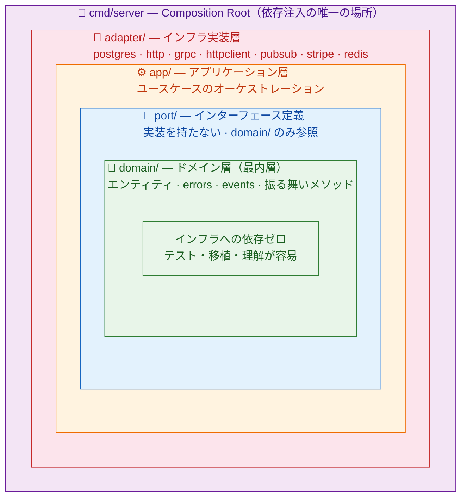
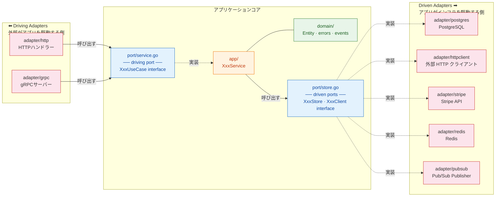
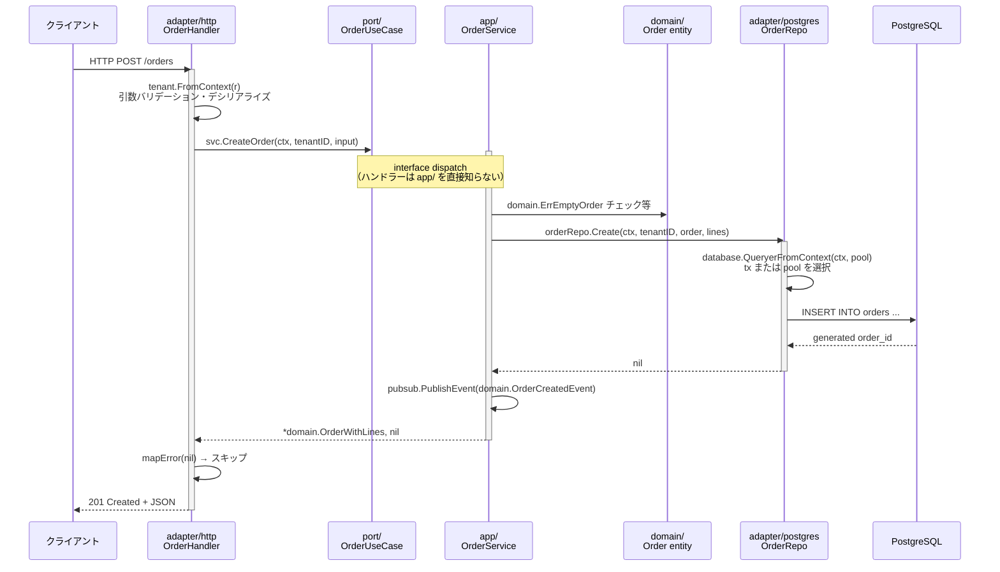
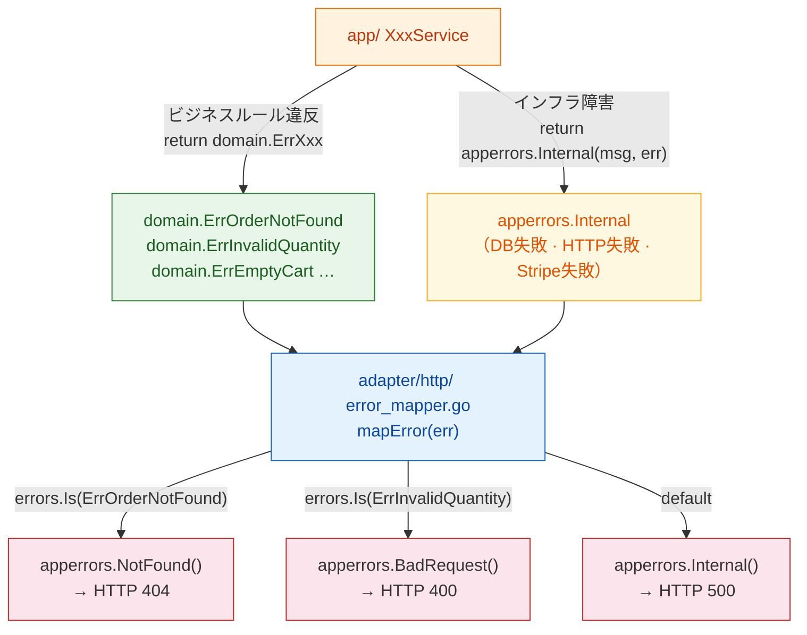
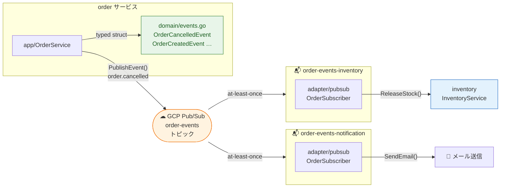
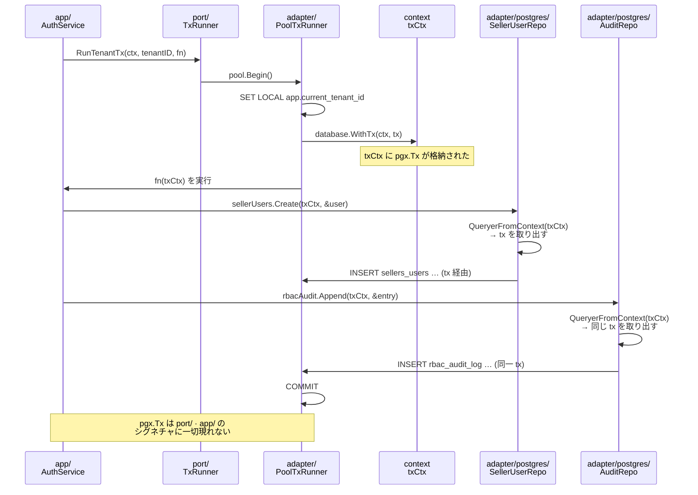

# ヘキサゴナルアーキテクチャ設計書

## 目次

- [概要と設計思想](#概要と設計思想)
- [アーキテクチャ図](#アーキテクチャ図)
  - [図1: レイヤー同心円モデル](#図1-レイヤー同心円モデル)
  - [図2: Driving と Driven アダプター](#図2-driving-と-driven-アダプター)
  - [図3: リクエスト処理の流れ](#図3-リクエスト処理の流れ)
- [依存方向の原則](#依存方向の原則)
- [ディレクトリ構造](#ディレクトリ構造)
- [各レイヤーの責務](#各レイヤーの責務)
  - [domain/](#domain)
  - [port/](#port)
  - [app/](#app)
  - [adapter/](#adapter)
  - [cmd/server/main.go](#cmdservermaingoの役割)
- [エラー処理の設計](#エラー処理の設計)
- [イベント設計](#イベント設計)
- [トランザクション設計](#トランザクション設計)
- [サービス間通信の設計](#サービス間通信の設計)
- [依存ルール違反の検出](#依存ルール違反の検出)

---

## 概要と設計思想

本システムの各マイクロサービスは **ヘキサゴナルアーキテクチャ（Ports & Adapters パターン）** に基づいて設計されています。

このアーキテクチャの中心的な問いは「**どのパッケージが何を知っていてよいか**」です。  
依存方向を明示的に制御することで、以下の性質を実現します：

- **テスタビリティ**: ドメインとアプリケーション層はインフラを知らないので、DB・HTTP・Stripeなしで単体テストできる
- **変更容易性**: 例えば PostgreSQL を別のDBに変えても `adapter/postgres/` だけ書き換えればよく、`app/` も `domain/` も変わらない
- **可読性**: ファイルの置き場所を見れば依存関係がわかる。`app/` にあるコードが pgx を import していれば一目で「おかしい」と気づける

---

## アーキテクチャ図

### 図1: レイヤー同心円モデル

依存は**外から内への一方向のみ**。内側のレイヤーは外側を一切知りません。



---

### 図2: Driving と Driven アダプター

ヘキサゴナルアーキテクチャの核心：アプリケーションコアは**どちらの側にも依存しない**。
左側のアダプターがアプリを「呼び出し」、右側のアダプターをアプリが「呼び出す」。
どちらとの境界も `port/` のインターフェースで切り離されています。



> **実線矢印 `→`**: 呼び出し関係（A が B のメソッドを呼ぶ）  
> **破線矢印 `-..->`**: 実装関係（B のインターフェースを A が実装する）

---

### 図3: リクエスト処理の流れ

HTTP リクエストが各レイヤーをどのように通過するかを示します。
`port.OrderUseCase` インターフェースが `app/OrderService` と `adapter/http/Handler` の
境界として機能し、両者が直接依存しない構造になっています。



---

## 依存方向の原則

```
domain/  ←  port/  ←  app/  ←  adapter/*  ←  cmd/server/
```

各レイヤーは**内側のレイヤーのみ**を参照できます。外側への参照は禁止です。

| レイヤー | 参照可能 | 参照禁止 |
|----------|----------|----------|
| `domain/` | 標準ライブラリ、`uuid`、`json` のみ | pkg/ 以外の全て |
| `port/` | `domain/` | adapter, app, pgx, net/http |
| `app/` | `domain/`, `port/`, `pkg/errors` | pgx, net/http, Stripe SDK |
| `adapter/*` | 全レイヤー + 外部ライブラリ | — |
| `cmd/` | 全レイヤー | — |

---

## ディレクトリ構造

各サービス（`backend/services/{name}/`）の標準レイアウト：

```
services/{name}/
  cmd/server/main.go          # 全レイヤーを組み立てる唯一の場所（Composition Root）
  internal/
    domain/                   # 最内層 — インフラへの依存ゼロ
      {entity}.go             #   エンティティ・値オブジェクト・振る舞いメソッド
      errors.go               #   ドメイン固有センチネルエラー（HTTPと無関係）
      events.go               #   型付きイベント構造体 + イベントタイプ定数
    port/                     # インターフェース定義のみ — 実装なし
      store.go                #   Driven ports: DB・外部APIクライアントのインターフェース
      service.go              #   Driving port: ユースケースインターフェース（ハンドラーが依存）
    app/                      # アプリケーション層（旧 service/）
      {name}_service.go       #   オーケストレーション: domain/ + port/ のみ import
    adapter/
      postgres/               #   pgxリポジトリ実装（旧 repository/）
        {entity}_repo.go
      http/                   #   chiハンドラー（旧 handler/）
        {name}_handler.go
        errors.go             #   ドメインエラー → HTTPステータスのマッピング（mapError関数）
      grpc/                   #   gRPCサーバー実装（旧 grpcserver/）
        server.go
        convert.go            #   proto ↔ domain 型変換
      httpclient/             #   アウトバウンドHTTPクライアント（旧 service/ 内に混在）
        {service}_client.go
      pubsub/                 #   Pub/Subサブスクライバー（旧 subscriber/）
        {source}_subscriber.go
      redis/                  #   Redisストア（cart サービスのみ）
      stripe/                 #   Stripeクライアント（order サービスのみ）
    config/config.go          #   環境変数設定
```

---

## 各レイヤーの責務

### `domain/`

**責務**: ビジネスルールの表現。インフラに無関係な純粋なGoコード。

```go
// domain/cart.go — エンティティと振る舞いメソッド
type Cart struct {
    TenantID     uuid.UUID
    BuyerAuth0ID string
    Items        []CartItem
    UpdatedAt    time.Time
}

// 振る舞いメソッド: ルールを持つ操作はエンティティ自身が担う
func (c *Cart) AddItem(item CartItem) {
    if idx := c.FindItem(item.SKUID); idx >= 0 {
        c.Items[idx].Quantity += item.Quantity
    } else {
        c.Items = append(c.Items, item)
    }
    c.UpdatedAt = time.Now().UTC()
}

func (c *Cart) SetItemQuantity(skuID uuid.UUID, quantity int) error {
    idx := c.FindItem(skuID)
    if idx < 0 {
        return ErrSKUNotInCart  // ドメインエラーを返す
    }
    c.Items[idx].Quantity = quantity
    c.UpdatedAt = time.Now().UTC()
    return nil
}
```

```go
// domain/errors.go — HTTPと無関係なセンチネルエラー
var (
    ErrEmptyCart           = errors.New("cart is empty")
    ErrSKUNotInCart        = errors.New("sku not in cart")
    ErrInvalidQuantity     = errors.New("quantity must be positive")
    ErrNonNegativeQuantity = errors.New("quantity must be non-negative")
)
```

```go
// domain/events.go — 型付きイベント構造体
const EventTypeOrderCreated = "order.created"

type OrderCreatedEvent struct {
    OrderID      string `json:"order_id"`
    SellerID     string `json:"seller_id"`
    BuyerAuth0ID string `json:"buyer_auth0_id"`
    TotalAmount  int64  `json:"total_amount"`
    Currency     string `json:"currency"`
}
```

**domain/ に入るもの**:
- エンティティ構造体とそのメソッド（`Order`, `Cart`, `Product` など）
- ドメインセンチネルエラー（`errors.New()` のみ）
- ビジネスルールの述語（`order.CanBeCancelled() bool` など）
- 型付きイベント構造体とイベントタイプ定数
- ドメイン固有フィルター型（`ProductFilter` など）

**domain/ に入れてはいけないもの**:
- pgx, net/http, Stripe など外部ライブラリへの参照
- リポジトリ呼び出し（DBアクセス）
- HTTP クライアント呼び出し
- `apperrors` などHTTP意味論を持つ型

---

### `port/`

**責務**: `app/` が外界と対話するための契約（インターフェース定義）のみ。実装は持たない。

```go
// port/store.go — Driven ports（app層が必要とするインフラ）
type OrderStore interface {
    Create(ctx context.Context, tenantID uuid.UUID, order *domain.Order, lines []domain.OrderLine) error
    GetByID(ctx context.Context, tenantID, orderID uuid.UUID) (*domain.OrderWithLines, error)
    // ...
}

type StripePayments interface {
    CreatePlatformPaymentIntent(amount int64, currency string, metadata map[string]string) (piID, clientSecret string, err error)
    CreateTransfer(amount int64, currency, destination, paymentIntentID string) (transferID string, err error)
}

type BuyerSubscriptionChecker interface {
    HasFreeShipping(ctx context.Context, tenantID uuid.UUID, buyerAuth0ID string) (bool, error)
}

// port/service.go — Driving port（ハンドラーが依存するユースケースインターフェース）
type OrderUseCase interface {
    CreateOrder(ctx context.Context, tenantID uuid.UUID, input domain.CreateOrderInput) (*domain.OrderWithLines, string, error)
    HandlePaymentSuccess(ctx context.Context, stripePaymentIntentID string) error
    GetOrder(ctx context.Context, tenantID, orderID uuid.UUID) (*domain.OrderWithLines, error)
    // ...
}
```

**port/ に入るもの**:
- `XxxUseCase` インターフェース（driving port）
- リポジトリ・外部クライアントインターフェース（driven port）
- `TxRunner` インターフェース
- `app/` と `adapter/httpclient/` の両方が必要とするDTO（循環import防止）

  例：`port.SKULookup`（catalog httpclient が返し、cart の app 層が使う）

---

### `app/`

**責務**: ユースケースのオーケストレーション。`domain/` と `port/` だけを使い、インフラを知らない。

```go
// app/order_service.go
func (s *OrderService) CreateCheckout(ctx context.Context, tenantID uuid.UUID, input domain.CheckoutInput) (*domain.CheckoutResult, error) {
    // 1. バリデーション（ドメインエラーを返す）
    if len(input.Lines) == 0 {
        return nil, domain.ErrEmptyOrder
    }

    // 2. Stripe 呼び出し（port.StripePayments インターフェース経由）
    piID, secret, err := s.stripe.CreatePlatformPaymentIntent(total, currency, metadata)
    if err != nil {
        return nil, apperrors.Internal("failed to create payment intent", err)  // インフラ障害
    }

    // 3. 永続化（port.OrderStore インターフェース経由）
    if err := s.orderRepo.CreateCheckoutBatch(ctx, tenantID, batch); err != nil {
        return nil, apperrors.Internal("failed to create checkout batch", err)
    }

    // 4. イベント発行（typed struct）
    pubsub.PublishEvent(ctx, s.publisher, tenantID, domain.EventTypeOrderCreated, "order-events",
        domain.OrderCreatedEvent{OrderID: order.ID.String(), ...})

    return result, nil
}
```

**エラー返却の原則**:
- ビジネスルール違反 → `domain.ErrXxx`（`apperrors` を使わない）
- インフラ障害（DB, HTTP, Stripe の失敗）→ `apperrors.Internal("文脈", err)`

---

### `adapter/`

**責務**: 技術的な実装。外部ライブラリを直接使ってよい唯一の場所。

#### `adapter/postgres/` — リポジトリ実装

```go
// adapter/postgres/order_repo.go
func (r *OrderRepo) GetByID(ctx context.Context, tenantID, orderID uuid.UUID) (*domain.OrderWithLines, error) {
    // context からトランザクションを取り出す（トランザクション中なら tx、そうでなければ pool）
    q := database.QueryerFromContext(ctx, r.pool)
    // ...
}
```

#### `adapter/http/` — HTTPハンドラー

```go
// adapter/http/order_handler.go
func (h *OrderHandler) handleGetOrder(w http.ResponseWriter, r *http.Request) {
    tc, _ := tenant.FromContext(r.Context())
    orderID := uuid.MustParse(chi.URLParam(r, "orderID"))

    order, err := h.svc.GetOrder(r.Context(), tc.TenantID, orderID)
    if err != nil {
        httputil.Error(w, mapError(err))  // ドメインエラー → HTTPステータス
        return
    }
    httputil.JSON(w, http.StatusOK, order)
}

// adapter/http/errors.go
func mapError(err error) error {
    var appErr *apperrors.AppError
    if errors.As(err, &appErr) {
        return appErr  // AppError はそのままスルー
    }
    switch {
    case errors.Is(err, domain.ErrOrderNotFound):
        return apperrors.NotFound(err.Error())
    case errors.Is(err, domain.ErrInvalidQuantity):
        return apperrors.BadRequest(err.Error())
    default:
        return apperrors.Internal("internal error", err)
    }
}
```

#### `adapter/httpclient/` — アウトバウンドHTTPクライアント

`port/store.go` のインターフェースを実装します。`app/` は具体的なHTTP実装を知りません。

```go
// adapter/httpclient/catalog_client.go
type CatalogClient struct { baseURL, internalToken string; httpClient *http.Client }

func (c *CatalogClient) LookupSKU(ctx context.Context, tenantID, skuID uuid.UUID) (*port.SKULookup, error) {
    req, _ := http.NewRequestWithContext(ctx, http.MethodGet, c.baseURL+"/internal/skus/"+skuID.String(), nil)
    req.Header.Set("X-Internal-Token", c.internalToken)
    req.Header.Set("X-Tenant-ID", tenantID.String())
    // ...
}
```

---

### `cmd/server/main.go` の役割

`main.go` はすべてのレイヤーが集まる唯一の場所（**Composition Root**）です。  
それ以外のパッケージは「自分が使う相手が誰か」を知りません。

```go
// cmd/server/main.go — 依存注入の場所
pool      := database.NewPool(cfg.DatabaseURL)
publisher := pubsub.NewGCPPublisher(ctx, cfg.ProjectID)

// adapter 層
orderRepo  := postgres.NewOrderRepo(pool)
payoutRepo := postgres.NewPayoutRepo(pool)
stripe     := stripe.NewClient(cfg.StripeKey)
buyerSub   := httpclient.NewBuyerSubscriptionClient(cfg.AuthServiceURL, cfg.InternalToken)

// app 層（port インターフェース経由で adapter を受け取る）
orderSvc := app.NewOrderService(orderRepo, payoutRepo, stripe, publisher, buyerSub, cfg.ShippingFee)

// adapter/http 層（port.OrderUseCase 経由で app を受け取る）
handler := orderhandler.NewOrderHandler(orderSvc)
```

---

## エラー処理の設計

エラーは「何を表しているか」によって型を使い分けます。

| エラーの種類 | 使う型 | 発生場所 |
|------------|--------|----------|
| ビジネスルール違反（見つからない、不正な状態） | `domain.ErrXxx`（sentinel） | `domain/`, `app/` |
| インフラ障害（DB失敗、HTTP失敗） | `apperrors.Internal(msg, err)` | `app/`, `adapter/` |
| HTTPレスポンスへのマッピング | `apperrors.NotFound()` 等 | `adapter/http/error_mapper.go` のみ |

この設計により `app/` は HTTP の知識を持たずに済みます。  
「ビジネス的に何が起きたか」と「それをどう HTTP に伝えるか」が分離されています。



---

## イベント設計

`map[string]any` ではなく型付き構造体を使います。これによりフィールド名のタイプミスがコンパイル時に検出されます。

```go
// domain/events.go — イベントタイプ定数と構造体をセットで定義
const EventTypeCartCheckedOut = "cart.checked_out"

type CartCheckedOutEvent struct {
    BuyerAuth0ID          string   `json:"buyer_auth0_id"`
    OrderIDs              []string `json:"order_ids"`
    StripePaymentIntentID string   `json:"stripe_payment_intent_id"`
    TotalAmount           int64    `json:"total_amount"`
    Currency              string   `json:"currency"`
}
```

```go
// app/ での発行
pubsub.PublishEvent(ctx, s.publisher, tenantID,
    domain.EventTypeCartCheckedOut, "cart-events",
    domain.CartCheckedOutEvent{
        BuyerAuth0ID: buyerAuth0ID,
        OrderIDs:     orderIDStrs,
        ...
    })
```

**トピックと購読設定**:

```
トピック: {domain}-events  （例: order-events, cart-events, product-events）
購読名:   {topic}-{consuming-service}  （例: order-events-inventory）
```

1つのトピックに複数の購読名を作ることで、複数サービスが独立してイベントを消費できます（ファンアウト）。

**サービス間のイベント構造体共有について**:  
各サービスは独立した Go モジュールのため、発行側の `domain.XxxEvent` をサブスクライバーが直接 import することはできません。  
受信側は同じ JSON フィールド名を持つ構造体をローカルに再定義します。  
→ **JSON タグ名がパブリックコントラクト**です。リネームは破壊的変更になります。



---

## トランザクション設計

`pgx.Tx` は `port/` や `app/` のシグネチャに現れません。  
トランザクションは **context に格納して伝播** します。

```
app 層: RunTenantTx(ctx, tenantID, func(txCtx context.Context) error)
             ↓ txCtx に tx を埋め込む（pkg/database/tx_context.go）
repo 層: database.QueryerFromContext(ctx, pool) → tx または pool を返す
```

```go
// app/auth_service.go — tx を context 経由で渡す
func (s *AuthService) AddSellerUser(ctx context.Context, tenantID uuid.UUID, ...) error {
    return s.db.RunTenantTx(ctx, tenantID, func(txCtx context.Context) error {
        if err := s.sellerUsers.Create(txCtx, &user); err != nil {
            return err
        }
        return s.rbacAudit.Append(txCtx, &auditEntry)
        // txCtx には同じ tx が入っているので、両メソッドは同一トランザクション内で実行される
    })
}
```

この設計の利点：
- `port/` インターフェースに pgx の型が漏れない
- リポジトリメソッドはトランザクション内外で同じシグネチャ
- ネストしたサービス呼び出しも context 伝播で自然に同一トランザクションに参加できる



---

## サービス間通信の設計

詳細は `knowledge/architecture-migration.md` および `service-boundaries.md`（skills）を参照。

| 通信方式 | 使う場面 |
|----------|----------|
| gRPC | gateway → downstream、または確立した永続APIサーフェス |
| 内部HTTP | gRPC未整備のサービス間（cart→catalog, inquiry→order など） |
| Pub/Sub | 非同期でよい場合、または複数サービスへのファンアウト |

内部HTTP では `X-Internal-Token` ヘッダーで認証します（サービス固有のシークレット）。  
呼び出し側は `adapter/httpclient/` にクライアントを置き、`port/store.go` のインターフェースを実装します。

---

## 依存ルール違反の検出

新しいコードを書いたら以下を確認します：

```bash
# port/ や app/ に pgx が入っていないこと
grep -r "jackc/pgx" internal/port/ internal/app/   # 何も出ないこと

# app/ に net/http が入っていないこと
grep -r '"net/http"' internal/app/                  # 何も出ないこと

# app/ の apperrors 使用が Internal() のみであること（ビジネスエラーは domain.ErrXxx を使う）
grep -n "apperrors\." internal/app/*.go | grep -v "Internal("

# ビルドとテスト
cd backend/services/{name}
go build ./...
go vet ./...
go test ./...
```
